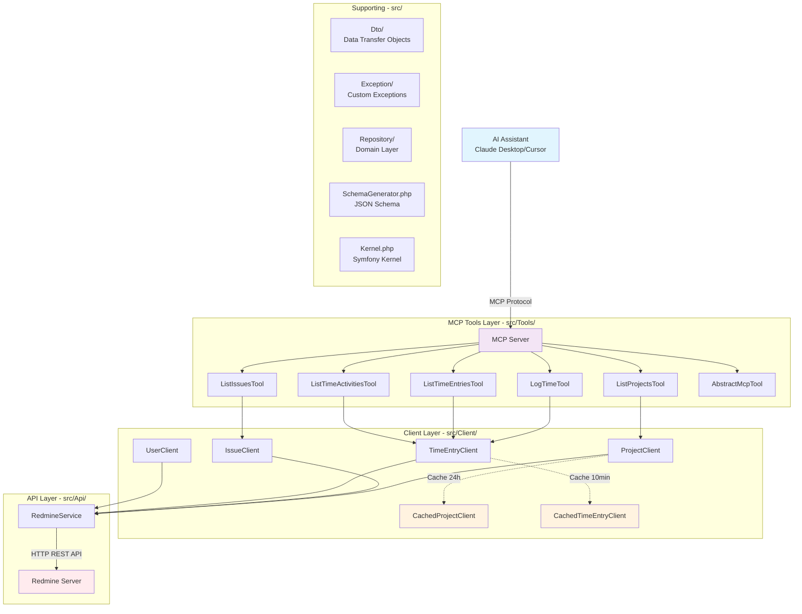

# MCP Redmine Server

An MCP (Model Context Protocol) server that integrates Redmine with AI assistants like Claude Desktop, enabling natural language interaction with your Redmine instance.

## 🚀 Quick Start

### 1. Installation

**Via Composer (Recommended):**
```bash
composer create-project guiziweb/mcp-redmine --no-dev --optimize-autoloader
```

**Via Git (For Development):**
```bash
git clone https://github.com/guiziweb/mcp-redmine.git
cd mcp-redmine
composer install
```

### 2. Configuration

> 💡 **Get your Redmine API key**: Go to Redmine → My account → API access key → Show

**For Claude Desktop (Recommended - Simple Setup):**

Create a `.mcp.json` file in your project directory. See [MCP Setup Guide](https://docs.anthropic.com/en/docs/claude-code/mcp) for detailed instructions.
```json
{
  "mcpServers": {
    "redmine": {
      "command": "php",
      "args": ["bin/console", "mcp:server"],
      "cwd": "/absolute/path/to/mcp-redmine",
      "env": {
        "REDMINE_URL": "https://your-redmine-instance.com",
        "REDMINE_API_KEY": "your_api_key_here"
      }
    }
  }
}
```

> ⚠️ **Important**: Replace `/absolute/path/to/mcp-redmine` with the full path to your project directory.

### 3. Restart Your AI Assistant

Close and restart your MCP client (Claude Desktop, Cursor, etc.).

## ✨ Features

### Available Tools

| Tool | Description | Usage Example |
|------|-------------|---------------|
| `redmine_list_projects` | List all your Redmine projects | "Show me all my Redmine projects" |
| `redmine_list_issues` | List issues from a specific project | "Show issues from project X" |
| `redmine_get_my_time_entries` | Get your time entries with filtering | "Show my time entries for August 2025" |
| `redmine_list_activities` | List available time entry activities | "What activities can I log time to?" |
| `redmine_log_time` | Log time to an issue | "Log 2 hours of development to issue #123" |

### Smart Features

- **Date Intelligence**: "Show my time for last month", "August 2025 entries"
- **Smart Summaries**: Automatic totals, weekly/daily breakdowns
- **Work Analysis**: Hours per day, project breakdowns, weekly patterns
- **Caching**: Projects and activities cached for performance

## 🛠 Development

### Requirements

- PHP 8.2+
- Composer
- Access to a Redmine instance with API enabled

### Testing

```bash
# Run all tests
composer test

# Run specific test
vendor/bin/phpunit tests/Tools/ListProjectsToolTest.php

# Run with coverage
vendor/bin/phpunit --coverage-html coverage
```

### Code Quality

```bash
# Static analysis
vendor/bin/phpstan analyze

# Code style
vendor/bin/php-cs-fixer fix
```

### Architecture



## 📚 Usage Examples

### Project Management
```
User: "List all my Redmine projects"
AI: Shows formatted list of projects with IDs and names

User: "Show me issues from project 'Mobile App'"
AI: Lists all issues from the specified project
```

### Time Tracking
```
User: "Show my time entries for August 2025"
AI: Displays time entries with daily/weekly totals and work analysis

User: "Log 3.5 hours of testing to issue #456"  
AI: Logs time entry with Testing activity to the specified issue
```

### Smart Analysis
```
User: "How many hours did I work last week?"
AI: Calculates and shows weekly totals with breakdown

User: "What's my daily average this month?"
AI: Shows monthly progress with hours per day analysis
```

## 🔧 Configuration Options

### Cache Settings

- **Projects**: 24 hours (rarely change)
- **Activities**:24 hours (rarely change)
- **Issues**: No cache (change frequently)
- **Time entries**: No cache (real-time data)

## 🚨 Security

- ✅ Environment-based configuration
- ✅ Validation on all inputs
- ✅ Error handling without data exposure

## 🐛 Troubleshooting

### Common Issues

1. **"No tools available"**
   - Check MCP configuration file path
   - Verify PHP is in PATH
   - Restart your AI assistant

2. **"Authentication failed"**
   - Verify `REDMINE_URL` and `REDMINE_API_KEY`
   - Check API key permissions in Redmine
   - Ensure API is enabled in Redmine settings

3. **"Command not found"**
   - Check `cwd` path in MCP config
   - Verify `composer install` was run
   - Check file permissions

## 🔗 Related

- [Model Context Protocol](https://github.com/anthropics/mcp)
- [Claude Desktop](https://claude.ai/desktop)
- [Redmine API Documentation](https://www.redmine.org/projects/redmine/wiki/Rest_api)
