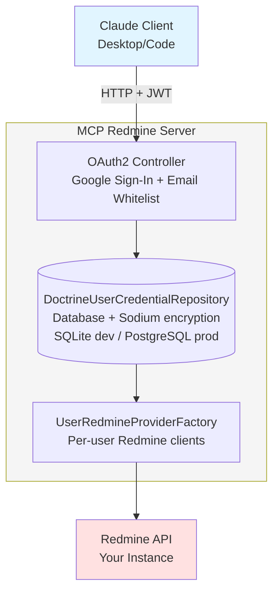

# MCP Redmine Server

A secure, multi-user MCP (Model Context Protocol) server that integrates Redmine with AI assistants like Claude Desktop and Claude Code. Features OAuth2 authentication, encrypted credentials, and natural language interaction with your Redmine instance.

## Features

- **OAuth2 Authentication**: Secure Google Sign-In for team authentication
- **Multi-user Support**: Each user has their own Redmine credentials
- **Encrypted Storage**: Credentials encrypted with Sodium (AES-256 equivalent)
- **Email Whitelist**: Domain-based access control (configurable)
- **HTTP Transport**: REST API with JWT tokens
- **Smart Time Tracking**: Natural language time logging with automatic summaries

## Quick Start

### For Users (Claude Desktop / Claude Code)

#### 1. Get the Server URL

Ask your administrator for:
- Server URL (e.g., `https://mcp-redmine.onrender.com`)
- Confirm your email is whitelisted

#### 2. Configure Claude Desktop

Edit `~/Library/Application Support/Claude/claude_desktop_config.json`:

```json
{
  "mcpServers": {
    "redmine": {
      "url": "https://mcp-redmine.onrender.com"
    }
  }
}
```

#### 3. Configure Claude Code

Edit `~/.config/claude-code/.mcp.json`:

```json
{
  "mcpServers": {
    "redmine": {
      "url": "https://mcp-redmine.onrender.com"
    }
  }
}
```

#### 4. Restart and Authenticate

1. Restart Claude Desktop/Code
2. First use will redirect you to Google Sign-In
3. After authentication, provide your Redmine URL and API key
4. Done! You can now interact with Redmine

### For Administrators (Deployment)

Deploy on Render.com (free tier) using the included `render.yaml` blueprint. See Google OAuth Configuration section below for setup instructions.

## Available Tools

| Tool | Description | Example Prompts |
|------|-------------|-----------------|
| **List Projects** | Show all accessible Redmine projects | "Show my projects", "List all projects" |
| **List Issues** | List issues from a specific project | "Show issues from Mobile App project", "List tickets in #123" |
| **Get Issue Details** | Get comprehensive issue information | "Show details of issue #456", "Get issue #789 with journals" |
| **List Time Entries** | Retrieve time entries with smart filtering | "Show my hours this week", "Time entries from August", "My daily average" |
| **Log Time** | Log time to an issue interactively | "Log 2 hours to issue #123", "Add time to ticket #456" |
| **List Activities** | Show available time entry activities | "Show activity types", "What activities can I log?" |

### Smart Features

- **Date Intelligence**: "last week", "this month", "August 2025"
- **Automatic Summaries**: Total hours, daily/weekly breakdowns
- **Work Analysis**: Hours per day, project breakdowns, patterns
- **Interactive**: Will ask for missing parameters

## Architecture



**Key Components:**
- **OAuth2 Controller**: Handles Google authentication and email whitelist verification
- **Credential Repository**: Stores encrypted Redmine credentials (URL + API key) per user
- **Provider Factory**: Creates per-user Redmine API clients on-demand
- **Encryption**: Credentials encrypted at rest with Sodium (XSalsa20-Poly1305)

## Development

### Requirements

- PHP 8.2+
- Composer
- Sodium extension
- Access to Redmine instance with API enabled

### Local Setup

```bash
# Clone repository
git clone https://github.com/guiziweb/mcp-redmine.git
cd mcp-redmine

# Install dependencies
composer install

# Configure environment
cp .env.example .env.local
# Edit .env.local with your settings

# Generate encryption key
php -r "echo base64_encode(random_bytes(SODIUM_CRYPTO_SECRETBOX_KEYBYTES)) . PHP_EOL;"

# Start development server (with ngrok for OAuth callback)
ngrok http 8000
php -S localhost:8000 -t public/
```

### Environment Variables

**Required:**
- `APP_URL`: Your server URL (ngrok for dev, custom domain for prod)
- `GOOGLE_CLIENT_ID`: From Google Cloud Console
- `GOOGLE_CLIENT_SECRET`: From Google Cloud Console
- `ENCRYPTION_KEY`: Base64-encoded 32-byte Sodium key
- `JWT_SECRET`: Random string for JWT signing

**Optional:**
- `APP_ENV`: `dev` or `prod` (default: `dev`)

### Testing

```bash
# Run all tests
composer test

# Run specific test
vendor/bin/phpunit tests/Tools/ListProjectsToolTest.php

# Static analysis
vendor/bin/phpstan analyze

# Code style
vendor/bin/php-cs-fixer fix
```

## Google OAuth Configuration

### 1. Create Google Cloud Project

1. Go to [Google Cloud Console](https://console.cloud.google.com/)
2. Create new project: "MCP Redmine"
3. Enable Google+ API

### 2. Configure OAuth Consent Screen

1. APIs & Services → OAuth consent screen
2. User Type: **External**
3. App name: "MCP Redmine"
4. Scopes: `email`, `profile` (non-sensitive, no validation required)
5. Test users: Add your team emails (or skip if using domain whitelist)

### 3. Create OAuth2 Credentials

1. APIs & Services → Credentials → Create Credentials → OAuth 2.0 Client ID
2. Application type: **Web application**
3. Authorized redirect URIs:
   - Development: `https://your-ngrok-url.ngrok-free.dev/oauth/google-callback`
   - Production: `https://mcp-redmine.onrender.com/oauth/google-callback`
4. Save and copy Client ID and Client Secret

### 4. Email Whitelist

Configure allowed users via environment variables in `.env.local` or Render dashboard:

```bash
# Allow entire domains (comma-separated)
ALLOWED_EMAIL_DOMAINS=example.com

# Allow specific emails (comma-separated)
ALLOWED_EMAILS=alice@example.com,bob@example.com
```

Both options can be combined. If neither is set, no users will be able to access the application.

## Troubleshooting

### "Email not authorized"
Your email is not in the whitelist. Contact your administrator.

### "No credentials found for user"
First-time users need to authenticate via OAuth and provide Redmine credentials.

### OAuth redirect fails
- Verify `APP_URL` matches your actual server URL
- Check Google Console redirect URIs match exactly
- Ensure OAuth2 credentials are correct in environment

### "Service unavailable" in production
- Check server logs
- Verify all environment variables are set
- Ensure encryption key is properly configured

## Contributing

Contributions are welcome! Please:
1. Fork the repository
2. Create a feature branch
3. Run tests and code quality checks
4. Submit a pull request

## License

MIT

## Support

- **Issues**: [GitHub Issues](https://github.com/guiziweb/mcp-redmine/issues)

## Related

- [Model Context Protocol](https://github.com/anthropics/mcp)
- [Claude Desktop](https://claude.ai/desktop)
- [Claude Code](https://docs.claude.com/claude-code)
- [Redmine API](https://www.redmine.org/projects/redmine/wiki/Rest_api)