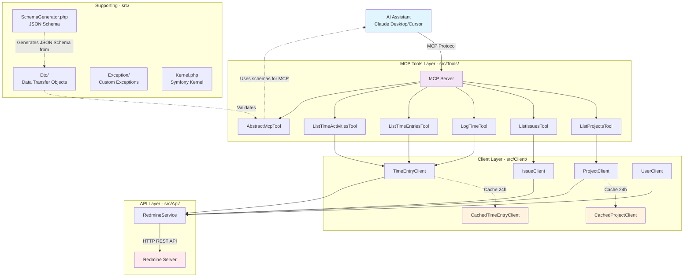

# MCP Redmine Server

An MCP (Model Context Protocol) server that integrates Redmine with AI assistants like Claude Desktop, enabling natural language interaction with your Redmine instance.

## 🚀 Quick Start

### 1. Installation

**Via Composer (Recommended):**
```bash
composer create-project guiziweb/mcp-redmine --stability=dev
```

**Via Git (For Development):**
```bash
git clone https://github.com/guiziweb/mcp-redmine.git
cd mcp-redmine
composer install
```

### 2. Configuration

> 💡 **Get your Redmine API key**: Go to Redmine → My account → API access key → Show

**For Claude Desktop (Recommended - Simple Setup):**

Create a `.mcp.json` file in your project directory. See [MCP Setup Guide](https://docs.anthropic.com/en/docs/claude-code/mcp) for detailed instructions.
```json
{
  "mcpServers": {
    "redmine": {
      "command": "php",
      "args": [
        "absolute/path/to/mcp-redmine/bin/console",
        "mcp:server"
      ],
      "env": {
        "REDMINE_URL": "https://your-redmine-instance.com",
        "REDMINE_API_KEY": "your_api_key_here"
      }
    }
  }
}
```

> ⚠️ **Important**: Replace `/absolute/path/to/mcp-redmine` with the full path to your project directory.

### 3. Restart Your AI Assistant

Close and restart your MCP client (Claude Desktop, Cursor, etc.).

## ✨ Features

### Available Tools

| Tool | Description | Parameters | Example Prompts |
|------|-------------|------------|-----------------|
| `redmine_list_projects` | Lists all your accessible Redmine projects with their hierarchy and IDs | None | • "Show me all my Redmine projects"<br>• "List my projects"<br>• "What projects do I have access to?" |
| `redmine_list_issues` | Lists issues from ONE specific project. Always shows the project list first and asks which project you want | • **project_id** (required): The project ID<br>• **limit** (optional): Max results (1-100, default: 25) | • "Show issues from project Mobile App"<br>• "List my tasks on project #123"<br>• "What tickets are assigned to me on project X?" |
| `redmine_list_time_entries` | Retrieves your time entries with smart filtering, totals, and work analysis (daily/weekly/project breakdowns) | • **from** (optional): Start date (YYYY-MM-DD)<br>• **to** (optional): End date (YYYY-MM-DD)<br>• **limit** (optional): Max results (1-100, default: 100)<br>• **project_id** (optional): Filter by project | • "Show my hours from August 1st to August 31st"<br>• "Show my time entries for last week"<br>• "What's my daily average this month?"<br>• "Get my hours by project" |
| `redmine_log_time` | Logs time to a specific issue. Will ask you for each parameter interactively (hours, comment, activity type) | • **issue_id** (required): The issue ID<br>• **hours** (required): Hours worked (0.1-24)<br>• **comment** (required): Work description (max 1000 chars)<br>• **activity_id** (required): Activity type ID | • "Log 2 hours to issue #123"<br>• "Add time to ticket #456"<br>• "I worked 3.5 hours on issue #789" |

### Smart Features

- **Date Intelligence**: "Show my time for last month", "August 2025 entries"
- **Smart Summaries**: Automatic totals, weekly/daily breakdowns
- **Work Analysis**: Hours per day, project breakdowns, weekly patterns
- **Caching**: Projects and activities cached for performance

## 🛠 Development

### Requirements

- PHP 8.2+
- Composer
- Access to a Redmine instance with API enabled

### Api

- **Redmine API Client**: [kbsali/redmine-api](https://github.com/kbsali/php-redmine-api) v2.8+ - A comprehensive PHP library for Redmine API
- 
### Testing

```bash
# Run all tests
composer test

# Run specific test
vendor/bin/phpunit tests/Tools/ListProjectsToolTest.php

# Run with coverage
vendor/bin/phpunit --coverage-html coverage
```

### Code Quality

```bash
# Static analysis
vendor/bin/phpstan analyze

# Code style
vendor/bin/php-cs-fixer fix
```

### Architecture



#### Key Architecture Concepts

**Automatic Schema Generation**: The tool input parameters are automatically generated from DTOs (Data Transfer Objects):
- Each tool has a corresponding DTO class (e.g., `ListIssuesRequest` for `ListIssuesTool`)
- DTOs use Symfony Validation constraints to define parameter rules
- `SchemaGenerator` automatically converts these DTOs with their validation constraints into JSON Schema
- This ensures type safety and validation at both the MCP protocol level and application level

Example flow:
1. `ListIssuesRequest` DTO defines `project_id` as required and positive integer
2. `SchemaGenerator` reads the validation constraints and generates JSON Schema
3. MCP uses this schema to validate inputs before calling the tool
4. The tool also validates using Symfony Validator for double safety

## 🔧 Configuration Options

### Cache Settings

- **Projects**: 24 hours (rarely change)
- **Activities**:24 hours (rarely change)
- **Issues**: No cache (change frequently)
- **Time entries**: No cache (real-time data)

## 🚨 Security

- ✅ Environment-based configuration
- ✅ Validation on all inputs
- ✅ Error handling without data exposure

## 🐛 Troubleshooting

### Common Issues

1. **"No tools available"**
   - Check MCP configuration file path
   - Verify PHP is in PATH
   - Restart your AI assistant

2. **"Authentication failed"**
   - Verify `REDMINE_URL` and `REDMINE_API_KEY`
   - Check API key permissions in Redmine
   - Ensure API is enabled in Redmine settings

3. **"Command not found"**
   - Check `args` path in MCP config (use absolute path)
   - Verify `composer install` was run
   - Check file permissions on bin/console

## 🔗 Related

- [Model Context Protocol](https://github.com/anthropics/mcp)
- [Claude Desktop](https://claude.ai/desktop)
- [Redmine API Documentation](https://www.redmine.org/projects/redmine/wiki/Rest_api)
